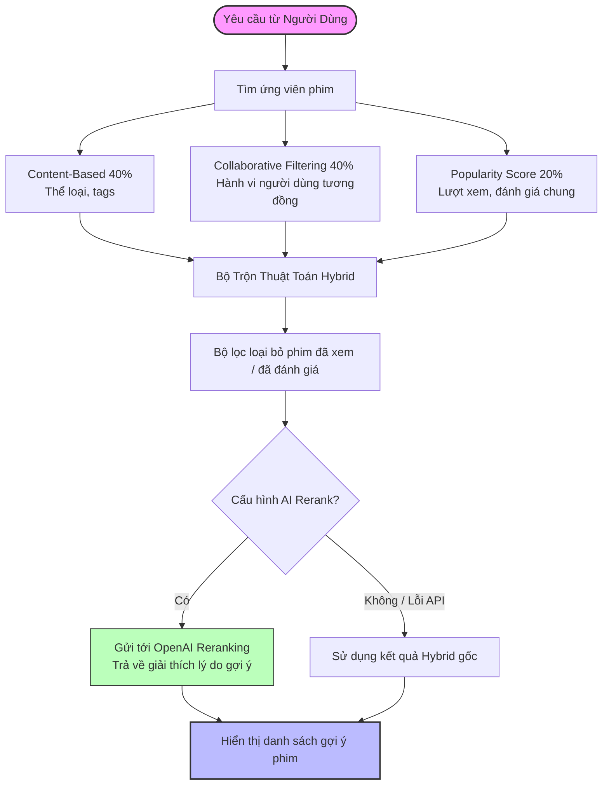
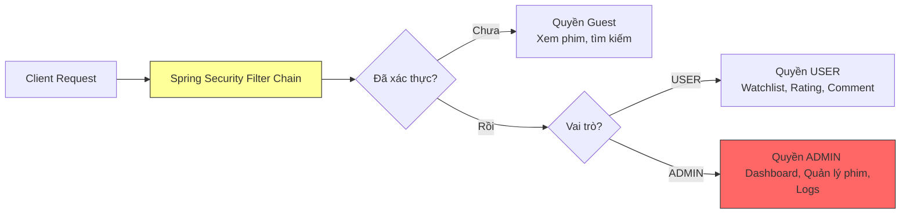

# <p align="center">🎬 MovieRec — AI Movie Recommendation System</p>

<p align="center">
  <b>Hệ thống gợi ý phim thông minh ứng dụng Học Máy & Trí Tuệ Nhân Tạo (AI)</b>
</p>

<p align="center">
  <i>Sự kết hợp hoàn hảo giữa thuật toán Hybrid (Content-based, Collaborative Filtering, Popularity) và mô hình ngôn ngữ lớn OpenAI GPT-4o-mini để cung cấp trải nghiệm giải trí cá nhân hóa vượt trội.</i>
</p>

<p align="center">
  <a href="https://movierecommendation-production-6e68.up.railway.app/">
    
  </a>
</p>

<p align="center">
  
  
  
  
  
</p>

---

## 📋 Mục Lục

- [✨ Tính Năng Nổi Bật](#-tính-năng-nổi-bật)
- [🛠️ Tech Stack Chi Tiết](#️-tech-stack-chi-tiết)
- [🏗️ Kiến Trúc Hệ Thống](#️-kiến-trúc-hệ-thống)
- [⚙️ Hướng Dẫn Cài Đặt Local](#️-hướng-dẫn-cài-đặt-local)
- [🚀 Deploy Lên Railway](#-deploy-lên-railway)
- [📁 Sơ Đồ Cấu Trúc Source Code](#-sơ-đồ-cấu-trúc-source-code)
- [👥 Quy Trình Phát Triển (Workflow)](#-quy-trình-phát-triển-workflow)
- [📞 Kênh Hỗ Trợ & Tài Liệu](#-kênh-hỗ-trợ--tài-liệu)

---

## ✨ Tính Năng Nổi Bật

### 🤖 AI & Recommendation Engine
* **Hybrid Recommendation**: Kết hợp linh hoạt giữa **Content-based (40%)**, **Collaborative Filtering (40%)** và **Popularity (20%)** để tối ưu hóa độ chính xác.
* **AI Reranking**: Tự động sắp xếp lại danh sách gợi ý và phản hồi lý do gợi ý phim trực quan bằng OpenAI.
* **Cold-Start Fallback**: Hệ thống tự động chuyển sang gợi ý theo sở thích ban đầu hoặc phim thịnh hành cho người dùng mới chưa có lịch sử xem.
* **Real-time Search**: Trải nghiệm tìm kiếm cực nhanh với tính năng tự động hoàn thành (autocomplete) thông minh.

### 🎥 Trải Nghiệm Người Dùng (UX/UI)
* **Trình phát Trailer**: Tích hợp xem trailer YouTube trực tiếp không cần chuyển trang.
* **Liên kết nhanh**: Tích hợp chuyển tiếp xem phim nhanh qua Netflix hoặc FPT Play.
* **Tương tác xã hội**: Đánh giá phim (thang điểm 0.5 đến 5.0), gửi bình luận và phân loại thẻ tag.
* **Trang cá nhân**: Watchlist riêng biệt, trang gợi ý cá nhân hóa **"For You"** và lịch sử tìm kiếm/xem phim chi tiết.

### 🔧 Quản Trị Hệ Thống (Admin Dashboard)
* **Metadata Auto-Sync**: Tự động đồng bộ hình ảnh poster và mô tả phim từ TMDB API.
* **Analytics Dashboard**: Thống kê số lượng tương tác, đăng ký người dùng mới, và lượt xem phim theo thời gian thực.
* **Data Guardrails**: Cơ chế kiểm duyệt thể loại, ngăn ngừa dữ liệu ảo và chức năng dọn dẹp data tự động.

---

## 🛠️ Tech Stack Chi Tiết

| Thành Phần | Công Nghệ & Thư Viện | Phiên Bản | Logo |
| :--- | :--- | :--- | :---: |
| **Backend Core** | Java, Spring Boot, Spring Data JPA | `21` / `3.4.5` |  |
| **Bảo Mật** | Spring Security, Session Management, BCrypt | `Latest` |  |
| **Giao Diện** | Thymeleaf, HTML5, CSS3 (Netflix Design Style), JS | `Modern CSS` |  |
| **Cơ Sở Dữ Liệu** | PostgreSQL | `14+` |  |
| **Bộ Nhớ Đệm** | Caffeine Cache | `Latest` |  |
| **Trí Tuệ Nhân Tạo** | OpenAI API Client | `gpt-4o-mini` |  |
| **Dữ Liệu Ngoài** | TMDB API, MovieLens 100K Dataset | `-` |  |
| **Build & Deploy** | Gradle, Docker, Railway Cloud | `8.x` |  |

---

## 🏗️ Kiến Trúc Hệ Thống

### 1. Thuật Toán Gợi Ý Hybrid (Recommendation Algorithm Flow)
Dưới đây là quy trình xử lý dữ liệu và trộn kết quả gợi ý của hệ thống:



### 2. Luồng Phân Quyền Bảo Mật (Security Flow)
Hệ thống sử dụng cơ chế bảo mật phân vai trò (RBAC) nghiêm ngặt:



---

## ⚙️ Hướng Dẫn Cài Đặt Local

### 📋 Yêu Cầu Hệ Thống
* **Java SDK 21**
* **PostgreSQL 14+**
* **Gradle 8.x** (đã tích hợp sẵn Gradle Wrapper)

### 1️⃣ Clone Repository
```bash
git clone https://github.com/nphu0811/movierecommendation.git
cd movierecommendation
```

### 2️⃣ Cấu Hình Cơ Sở Dữ Liệu
Hãy tạo một Database PostgreSQL trống tên là `movierecommendation` thông qua pgAdmin hoặc SQL Shell:
```sql
CREATE DATABASE movierecommendation;
```

### 3️⃣ Cấu Hình File `application.properties`
Sao chép cấu hình mẫu và chỉnh sửa thông tin phù hợp:
```bash
cp src/main/resources/application.properties.example \
   src/main/resources/application.properties
```

Mở file `src/main/resources/application.properties` và cập nhật các thông số quan trọng:
```properties
# Cơ sở dữ liệu local
spring.datasource.url=jdbc:postgresql://localhost:5432/movierecommendation
spring.datasource.username=postgres
spring.datasource.password=mat_khau_cua_ban

# Tích hợp API Keys ngoại vi
tmdb.api.key=YOUR_TMDB_API_KEY
openai.api.key=sk-proj-YOUR_OPENAI_KEY
ai.api-key=YOUR_AI_API_KEY

# Khóa bảo mật ghi nhớ đăng nhập (Sử dụng chuỗi ngẫu nhiên dài hơn 32 ký tự)
app.remember-me-key=YOUR_RANDOM_SECRET_KEY_GOES_HERE
```

> [!TIP]
> **Cách lấy API Keys miễn phí / thử nghiệm:**
> * **TMDB API Key**: Đăng ký tài khoản tại [The Movie Database](https://www.themoviedb.org/) và tạo API Key trong trang cài đặt tài khoản.
> * **OpenAI API Key**: Truy cập vào [OpenAI Platform](https://platform.openai.com/) để khởi tạo Key mới.

### 4️⃣ Khởi Chạy Ứng Dụng
Sử dụng Gradle Wrapper để build và chạy ứng dụng:
```bash
# Build và chạy ngay lập tức
./gradlew bootRun

# Hoặc đóng gói thành file JAR rồi chạy độc lập
./gradlew build
java -jar build/libs/movierecommendation-*.jar
```
Truy cập giao diện tại: **http://localhost:8080**

### 👤 Tài Khoản Trực Quan & Dữ Liệu Mẫu
Để tự động khởi tạo dữ liệu phim và tài khoản Admin khi chạy lần đầu, hãy bật tính năng demo seed:
```properties
app.demo.seed-enabled=true
app.demo.password=MAT_KHAU_DEMO_LON_HON_12_KY_TU
```
* **Email quản trị mặc định**: `admin@movierec.com`

---

## 🚀 Deploy Lên Railway

Hệ thống đã cấu hình sẵn tương thích tối đa để deploy một chạm trên nền tảng **Railway.app**.

### 📌 Các Biến Môi Trường (Environment Variables) Cần Thiết

| Tên Biến | Giá trị / Định dạng | Ghi chú |
| :--- | :--- | :--- |
| `SPRING_PROFILES_ACTIVE` | `prod` | Kích hoạt profile production |
| `SPRING_DATASOURCE_URL` | `jdbc:postgresql://${{Postgres.PGHOST}}:${{Postgres.PGPORT}}/${{Postgres.PGDATABASE}}` | Kết nối tự động tới plugin Postgres của Railway |
| `REMEMBER_ME_KEY` | Chuỗi secret bảo mật | Độ dài tối thiểu 32 ký tự |
| `OPENAI_API_KEY` | `sk-proj-...` | API Key OpenAI |
| `TMDB_API_KEY` | Key TMDB của bạn | Phục vụ lấy ảnh phim tự động |

### 🔄 Các bước thực hiện nhanh
1. Kết nối Repository GitHub của bạn với Railway Project.
2. Thêm plugin **PostgreSQL** trong Railway.
3. Cập nhật các biến môi trường như bảng trên.
4. Railway sẽ tự động build từ `Dockerfile` và deploy trong vài phút.

---

## 📁 Sơ Đồ Cấu Trúc Source Code

```text
movierecommendation/
├── src/main/java/com/example/movierecommendation/
│   ├── algorithm/           # 🤖 Thuật toán cốt lõi (Recommendation, Content-Based, Collaborative)
│   │   └── RecommendationEngine.java
│   ├── config/              # ⚙️ Cấu hình hệ thống (Security, Caches, WebClient)
│   ├── controller/          # 🌐 HTTP MVC Controllers (Admin, Movie, User)
│   ├── entity/              # 🗄️ JPA Entity Models (User, Movie, Rating, Comment...)
│   ├── repository/          # 🔍 Spring Data JPA Database Repository Queries
│   └── service/             # 💼 Logic nghiệp vụ chính (OpenAI, TMDB Sync, Mail)
├── src/main/resources/
│   ├── templates/           # 🎨 Thymeleaf View Pages (.html)
│   │   ├── admin/           # Dashboard quản trị
│   │   ├── movie/           # Chi tiết phim, danh sách phim
│   │   └── user/            # Watchlist, thông tin cá nhân, lịch sử
│   └── static/              # ⚡ Resource tĩnh (CSS, JS, Fonts)
├── build.gradle             # Cấu hình Gradle build & dependencies
├── Dockerfile               # Định nghĩa Docker Image
└── README.md                # Tài liệu hướng dẫn
```

---

## 👥 Quy Trình Phát Triển (Workflow)

Để đảm bảo code luôn sạch và tránh xung đột, team tuân thủ quy trình Git Flow dưới đây:

```
[main branch] ────┬───────────────► [pull origin main] ──────┬──────────────► [merge & push]
                  │                                         ▲
                  └─► [checkout feature/new-feature] ──► [code & PR]
```

1. **Cập nhật code mới nhất**: `git pull origin main`
2. **Tạo nhánh chức năng**: `git checkout -b feature/your-feature`
3. **Commit theo chuẩn**: `git commit -m "✨ Add AI Summary Tool for videos"`
4. **Tạo Pull Request trên GitHub**: Chờ phê duyệt từ các thành viên khác trước khi thực hiện merge.

---

## 📞 Kênh Hỗ Trợ & Tài Liệu

* **Báo cáo lỗi / Đóng góp ý kiến**: Vui lòng tạo một [GitHub Issue](https://github.com/nphu0811/movierecommendation/issues).
* **Tài liệu tham khảo chính**:
  * [Spring Framework Documentation](https://spring.io/projects/spring-boot)
  * [TMDB API Reference Guide](https://developer.themoviedb.org/docs)
  * [OpenAI API Docs](https://platform.openai.com/docs)

---
## 📄 License

MIT License - Xem file [LICENSE](LICENSE) để chi tiết.

---

## 👨‍💻 Contributors

| Role | Contact |
|------|---------|
| Team Lead & Backend |  [@Yuhnart-07](https://github.com/Yuhnart-07) |
| FullStack |[@nphu0811](https://github.com/nphu0811) |

---

<div align="center">

**Made with ❤️ by MovieRec Team**

⭐ Hãy tặng dự án 1 Star nếu bạn cảm thấy nó hữu ích!

</div>
